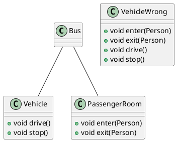
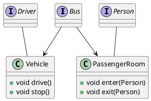
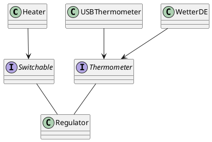

# Advanced Software Engineering 2

[TOC]

## Programmierprinzipien

- sind Leitfaden
- Verantwortung festlegen

### ToDo

- [ ] Ergänze fehlende Prinzipien
- [ ] Füge Graphen hinzu
- [ ] Erkläre kurz

### Solid
#### (S)ingle Responsibility

- Klasse sollte nur einen Grund oder Ursache haben, sich zu ändern
- jede Klasse nur eine Zuständigkeit
- eine Klasse erhält Achsen, auf der sich Anforderungen ändern können
  - jede Zuständigkeit-> neue Achse, nur eine Achse pro Klasse




#### (O)pen Closed Principle

Elemente der Software wie Klassen, Module und Funktionen sollten
* offen für Erweiterung sein
* geschlossen für Änderungen sein

Erweiterung nur über Vererbung bzw. Implementierung von Interfaces (optimal)
> bestehender Code wird nicht geändert

* Abstraktionen fördern die Erweiterbarkeit
* Software nie immun gegen Änderungen
#### (L)iskov Substitution Principle
* Abgeleitete Typen müssen schwächere Vorbedingungen haben
* Abgeleitete Typen müssen stärkere Nachbedingungen haben
* Beispiel Quadrat($width^2$) erbt von Rechteck($width*height$)
> Wenn sich das Objekt so verhält, wie sein Oberklasse

```mermaid
digraph
{
Graphisches Element -> Rechteck;
Graphisches Element -> Ellipse -> Kreis;
Graphisches Element -> Text;
}
```
#### (I)nterface Segregation Principle
Anwender sollen nicht von Funktionen abhängig sein, die sie nicht brauchen
> Übergebe User nur Interface mit Funktionen, die er benötigt
* Typen implementieren meist mehrere Interfaces



#### (D)ependency Inversion Principle

High-Level Module von Low-Level Modulen abhängig
> Änderung in Low-Level Implementierung ändert High-Level Modul
* schlecht
* besser => High-Level Modul von Abstraktionen abhängig
* Abstraktionen nicht von Details abhängig
* Details abhängig von Abstraktionen

> * Regeln durch High-Level Module vorgeben
> * Low-Level implementiert Regeln
> * High-Level können wiederverwendet werden (bilden Framework)

Beispiel UML Klassen Diagramm

* Klassen sollten nur abstrakte Klassen oder Interfaces ableiten und implementieren
* Variablen und Members sollten eine abstrakte Klasse oder Interface als Typ haben
* nur abstrakte Methoden implementieren
* beim Initialisieren der Anwendung werden Instanzen konkreter Klassen erzeugt

### Tell, don't ask
* Prozeduraler Code kappelt sich stark an andere Elemente
* Kommandos an Objekte besser als Abfragen
* holt sich erst Informationen, entscheiden Datenbankschema
#### Prozedurale Vorgehensweise
* Status eines Objektes Abfragen
* Entscheidung treffen
> führt zu zentraler Businesslogik
#### Objektorientierte Vorgehensweise
* Element etwas ausführen lassen
* Objekte Experten ihrer internen Informationen
* Objekt hat alle Informationen, um eine Entscheidung selbst zu treffen
> führt zu verteilter Businesslogik
### Kiss (Keep it simple, stupid)
Herkunft in der US Navy 1960
* einfache Systeme arbeiten am besten
* Komplexität unter allen Umständen vermeiden
* Linux Arch
* Komplexität erhöht Chance einen Fehler zu machen

### SLAP (Single Level of Abstraction Principle)
* Prinzip des einfachen Abstraktionsniveau
* keine Vermischung von Arbeit und Delegation
* keine Vermischung von DB und Businesslogik
* Fördert Wiederverwendbarkeit

### GRASP
* General Responsibility Assignment Software Pattern
* Low Representational Gap (LRG) klein halten:
  * Lücke zwischen gedachten Domänenmodell und Softwareimplementierung
* Zuweisung von Verantwortlichkeiten bzw. Zuständigkeiten
* geringe Kopplung
* Kopplung beschreibt die Beziehung zwischen Objekten (Maß für die Abhängigkeiten)

Vorteile:
* geringe Abhängigkeiten
* einfach testbar
* einfacher wiederverwendbar
### Low Coupling
Die Abhängigkeiten verringern, um das eigene Paket von der Landschaft "abzukoppeln"
> Koppelung ist der Maß von Abhängigkeiten von Paketen und Objekten

Effekte:
* geringe Abhängigkeiten zu Änderungen in anderen Teilen
* einfacher testbar
* verständlicher, da weniger Kontext notwendig ist
* einfacher wiederverwendbar

### High Cohesion
Kohäsion ist ein Maß für die Zusammenhalt einer Klasse. Hohe Kohäsion und lose Kopplung als Fundament für idealen Code.

### Information Expert
Kapselung von Informationen
Leichtere Klassen, da Businesslogik zu den Daten verteilt wird

### Indirection

### DRY (Don’t Repeat Yourself ! )
* wiederhole dich nicht
* Anwendbar:
* Datenbankschema
* Testpläne
* Buildsystem
* Dokumentation
* Gegenteil:
* WETYAGNI (You ain’t gonna need it)du wirst es nicht brauchen

## DevOps

- eine **Bewegung** mit dem Ziel **Time-To-Market** einer **Änderungseinheit** zu reduzieren, bei gleichzeitiger Gewährleistung **hoher Qualität**
- durch Anwendung des **Lean-Prinzip** auf den gesamten **Software-Wertstrom**

### Warum

- Dev **schnell Veränderungen umsetzen**
- Ops (Administrator) sollen **Sicherheit und Stabilität** der Systeme gewährleisten
- ​

### Lean

**Philsophie**, mit Ziel, einen **Prozess** durch die **Eliminierung von Verschwendung kontinuierlich** zu verbessern und dabei die **Bedürfnisse der Kunden** als **Ausgangspunkt allen Handelns** sieht

Verschwendung erkennen:

- Materialbewegung
- Bestände::
- Bewegung
- Wartezeiten
- Verarbeitung
- Überproduktion
- Korrekturen und Fehler

Verschwendung beseitigen:

Pull Prinzip:

- es wird nur produziert:
  - **was** der Kunde will
  - **wenn** der Kunde es will
