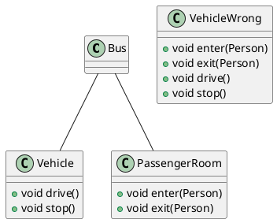
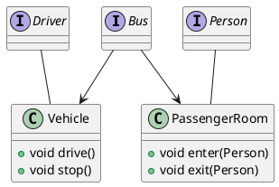
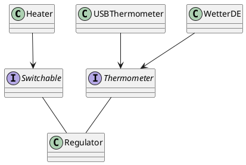
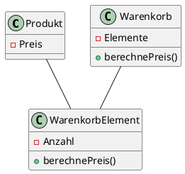

## Programmierprinzipien

- sind Leitfaden
- Verantwortung festlegen

### Solid
#### (S)ingle Responsibility

- Klasse sollte nur einen Grund oder Ursache haben, sich zu ändern
- jede Klasse nur eine Zuständigkeit
- eine Klasse erhält Achsen, auf der sich Anforderungen ändern können
  - jede Zuständigkeit-> neue Achse, nur eine Achse pro Klasse




#### (O)pen Closed Principle

Elemente der Software wie Klassen, Module und Funktionen sollten
* offen für Erweiterung sein
* geschlossen für Änderungen sein

Erweiterung nur über Vererbung bzw. Implementierung von Interfaces (optimal)
> bestehender Code wird nicht geändert

* Abstraktionen fördern die Erweiterbarkeit
* Software nie immun gegen Änderungen
#### (L)iskov Substitution Principle
* Abgeleitete Typen müssen schwächere Vorbedingungen haben
* Abgeleitete Typen müssen stärkere Nachbedingungen haben
* Beispiel Quadrat($width^2$) erbt von Rechteck($width*height$)
> Wenn sich das Objekt so verhält, wie sein Oberklasse

```mermaid
digraph
{
Graphisches Element -> Rechteck;
Graphisches Element -> Ellipse -> Kreis;
Graphisches Element -> Text;
}
```
#### (I)nterface Segregation Principle
Anwender sollen nicht von Funktionen abhängig sein, die sie nicht brauchen
> Übergebe User nur Interface mit Funktionen, die er benötigt
* Typen implementieren meist mehrere Interfaces



#### (D)ependency Inversion Principle

High-Level Module von Low-Level Modulen abhängig
> Änderung in Low-Level Implementierung ändert High-Level Modul
* schlecht
* besser => High-Level Modul von Abstraktionen abhängig
* Abstraktionen nicht von Details abhängig
* Details abhängig von Abstraktionen

> * Regeln durch High-Level Module vorgeben
> * Low-Level implementiert Regeln
> * High-Level können wiederverwendet werden (bilden Framework)

Beispiel UML Klassen Diagramm

* Klassen sollten nur abstrakte Klassen oder Interfaces ableiten und implementieren
* Variablen und Members sollten eine abstrakte Klasse oder Interface als Typ haben
* nur abstrakte Methoden implementieren
* beim Initialisieren der Anwendung werden Instanzen konkreter Klassen erzeugt

### Tell, don't ask
* Prozeduraler Code kappelt sich stark an andere Elemente
* Kommandos an Objekte besser als Abfragen
* holt sich erst Informationen, entscheiden Datenbankschema
#### Prozedurale Vorgehensweise
* Status eines Objektes Abfragen
* Entscheidung treffen
> führt zu zentraler Businesslogik
#### Objektorientierte Vorgehensweise
* Element etwas ausführen lassen
* Objekte Experten ihrer internen Informationen
* Objekt hat alle Informationen, um eine Entscheidung selbst zu treffen
> führt zu verteilter Businesslogik
### Kiss (Keep it simple, stupid)
Herkunft in der US Navy 1960
* einfache Systeme arbeiten am besten
* Komplexität unter allen Umständen vermeiden
* Linux Arch
* Komplexität erhöht Chance einen Fehler zu machen

### SLAP (Single Level of Abstraction Principle)
* Prinzip des einfachen Abstraktionsniveau
* keine Vermischung von Arbeit und Delegation
* keine Vermischung von DB und Businesslogik
* Fördert Wiederverwendbarkeit

### GRASP
- General Responisbility Assigment SW Patterns
- Basis-Prinzipien auf denen Entwurfsmuster aufbauen
- Low Representational Gap (LRG) minimieren
  - Lücke zwischen Domänenmodell und Implementierung
- Zuweisung von Zuständigkeiten (2 Typen: Ausführung, Wissen)
#### Low Coupling
  - Geringe Kopplung, Abhänigigkeit zw. Objekten
  - Leichter änderbar, testbar, wiederverwendbar, verständlicher
  - Bsp: Impl. von Interfaces, Vererbung, gemeinsame Dateien, Locks durch Threads
#### High Cohesion
- Zusammenhalt einer Klasse: Semantische Nähe der Elemente
- Einfacher, verständlicher, wiedervendbarer
- Schwer bestimmbar, ggf. durch Anzahl Verwendungen, Anzahl Attribute
#### Information Expert
- Zuweisung einer Zuständigkeit zu einem Objekt
- Objekte sind zuständig für Aufgaben über die sie Informationen besitzen
- Kapselung von Infos, leichtere Klassen <-> ggf. Problem mit anderen Prinzipien

#### Creator
- Wer ist für Erzeugung eines Obj. Zuständig?
- Wenn das Objekt zu jedem erstellen Objekt eine Beziehung hat (z.B. Komposition,
wenn a Teil von B ist [Raum, Haus])
- Verringert Kopplung
#### Indirection
- Indirektion/Delegation, kann Syteme oder Teile voneinander entkoppeln
- Mehr Freiheitsgerade als Vererbung
- Komposition verschiedener Objekte möglich
- Bsp: Objekt nutzen statt davon erben
#### Polymorphism
- Behandlung von Alternativen abhängig von einem konkreten Typ
- Methoden erhalten je nach Typ andere Implementierung
- Vermeidung von Fallunterscheidung
- Abstrakte Klasse, Interface als Basistyp
- Polymorphe Methodenaufrufe erst zur Laufzeit gebunden
- -> Entwurfsmuster Strategie
- Beispiel: Steuer-Interface, Deutschland, Frankreich-Klasse
- Erweiterbar, bestehendes muss nicht geändert werden, extrahierung von
Frameworks vereinfacht
#### Controller
- Verarbeitung von einkommenden Benutzereingaben
- Koordination zwischen UI und Logik
- Delegation zu anderen Objekten
- Zustand der Anwendung kann in Controller gehalten werden
- Arten
  - System Controller: Controller für alle Aktionen
  - Use Case Controller: Controller pro Use-Case,
#### Pure Fabrication
- Reine Erfindung, reine Verhaltens- / Arbeitsklasse ohne Bezug zur Domäne
(möglichst selten!)
- Trennung zw. Technik und Domäne
- Wiederverwendbar, High Cohesion
#### Protected Variations
- Sicherung vor Variation
- Kapselung versch. APIs hinter einheitlicher API
- Polymorphie, Delegation als Schutz
- Bsp: OS (HW), SQL (DB)

### DRY (Don’t Repeat Yourself ! )
* wiederhole dich nicht
* Anwendbar:
* Datenbankschema
* Testpläne
* Buildsystem
* Dokumentation
* Gegenteil:
* WETYAGNI (You ain’t gonna need it)du wirst es nicht brauchen

### YAGNI
- You ain’t gonna need it (Du wirst es nicht brauchen)
- Unnötige Features erhöhen Komplexität, binden Ressourcen
- Eigene Ideen -> schwer objektiv betrachtbar
- Frameworks sinnvoll, wenn sie aus dem Projekt heraus entstehen, nicht wenn sie durch
spekulatives Programmieren entstehen
- Kommunikation zw. Entwicklung u. Kunde wichtig

### Conway’s Law
- Kommunikationsstruktur findet sich in Code wieder
- Kommunikationsschnittstellen = Modulschnittstellen im Code
- Müssen zum Produkt passen…
- Bei Neuausrichtig des Produkts -> Kommunikationsstruktur anpassen
- Beispiel: Konzernwebseiten spiegeln Org. wieder statt Bedürfnisse des Kunden
