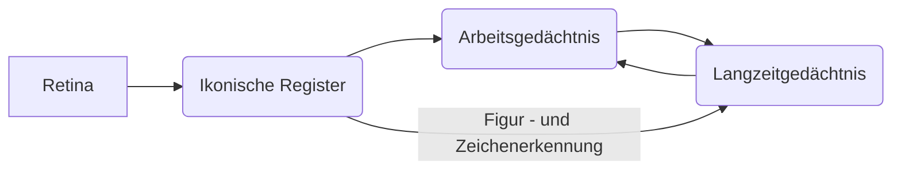

# Interaktive Systeme
[TOC]
## UX vs UI
- UX = Nutzereindruck (visueller, nicht-visueller Anteil)
- UI = visueller Aspekt

### Kompromiss
- Sicherheitsfragen: nervig, können aber im Ernstfall nützlich sein
- Passworteingabe unbequem, schützt jedoch Daten
- umfangreiche Einstellmöglichkeiten <-> Ease of use

### Big Picture First
- High Level Betrachtung
- Prinzip: avoid local optimization
- Werkzeug: Low Res Wireframe
### Detail First Thinking
- Low Level Betrachtung
### User Flows
- Schritte, die der User durchläuft um die UI zu bedienen
### Low Res Wireframe
- Blaupause für das Design

## Kognitive Psychologie
- Wissenschaft der menschlichen  Informationsverarbeitung
- MCI => Anwendung der kognitiven Psychologie
- KI und Neuroinformatik => von kognitive Psychologie inspiriert

### menschlicher Speicher

#### sensorischer Speicher
- hohe Kapazität
- geringe Lebenszeit ( < 1s)
- sensorische Informationen
#### Arbeitsgedächnis
- begrenzte Kapazität
- mittlere Dauer (15-30 s)
- symbolische Information
#### Langzeitgedächnis
- unbegrenzte Kapazität
- Dauer unbegrenzt
- semantische und episodische Information
> steht nur solange zur Verfügung, wie Assoziationen zu Element in diesem Speicher bestehen

### Unser Speicher
#### Arbeitsgedächtnis (AG)
- Wenige Einheiten (früher: etwa 7, heute:3-4), Superzeichenbildung
- Prinzip: “Reduce Short-Term Memory Load” (vgl. Shneiderman's "Eight Golden Rules of Interface Design") oder nach Jobs: Keep it simple

#### Langzeitgedächtnis (LZG)
- Inhaltsadressierter Speicher
- Informationen assoziativ verknüpft
#### Konsequenzen
- “Geschickte” Gruppierung ist wichtig
- Erinnerungshinweise
- Flexible (adaptierbare) Benennung von Objekten

## User Centered Design
- Einfluss persönliche Preferenzen
- Nutzer steht im Vordergrund der Anwendungsentwicklung

### Preference Biased Design
- Entwickler hat Framework im Kopf
> schränkt Entwicklung ein
> Ideen vom Designer so nicht umsetzbar

### Approached-Biased Design
- Entwickleransatz:
  - Feature Listen erstellen
  - Angefangen zu programmieren
  - Recherche nach Frameworks und API
- Designeransatz:
  - UI Mockups
  - Low res Mockups gezeichnet

### User Centered Design
- Augrund der schwächen der anderen Methoden wird diese verwendet !!!!
- Persona
  - Proxy zum Nutzer
- Use Case
  - Wann, Wo und Wie nutzt der Nutzer das Produkt

### Personas
- fiktive Darstellung des optimalen Kundens

#### Warum
- Wissen über Anforderungen des Nutzers
- konkrete Vorstellung über Kontext und Ziel des Nutzeres
- Verhaltensmuster und Zielgruppe identifizieren

#### Bestandteile
##### Allgemeines
- Kurzbeschreibung
- Privat - und Berufsleben
- Job, Position
- Schule
- Hobbies
- Alter
- Einkommen
- Urbanität(Stadt, Dorf, Türkei, Gullak)

##### Persönlichkeit
- Identitätsmerkmale
- Charakteristiken
- Einstellungen
- Nutzertype (Early Adopter)

##### Technologie, Medienverhalten
- Online Affinität
- Blog
- Platformen ( Windows, Linux )

##### Produkt und Service Charaktika
- Aufgaben, Nutzungsverhalten
- Hindernisse, Frustrationspunkte
- Produkt-/ Leistungsversprechen
- Erscheinung und Nutzungsqualität

#### Wie erstellen?
- Marktforschung
- reale Daten (Windows 10 Spy Software Datensammelorgie)
- auch : Annahmen, Spekulationen

##### User Research
- Interviews
- Beobachtungen
- Fallstudien
## Menschliche Sensoren
- Sensoren = Sinnesorgane
- Mediale Welt = sprechen mehrere Sensoren gleichzeitig an
  - Sehen
  - Riechen
  - Hören
  - Schmecken
  - Fühlen
### Haptik
- in der Haut, den Muskeln und Sehnen
#### Tastsinn
- Rezeptoren in der Haut
- Berührung als chemische, elektronische, themische , mechanische Stimulation
- taktil: nur elektronische Stimulation  
- kutan : alle Wahrnehmung der Haut
### Gleichgewichtssinn
- dient zur Feststellung der Körperhaltung im Raum und der Orientierung
### Wärmesinn
- Aufrechterhaltung der Körperwärme
- Schutz vor zur hoher / niedriger Temperatur

### Geruchsinn
- Identifikation von Nahrung und Feinden

### Geschmacksinn
- Wahrnehmung über Geschmackssensoren auf der Zunge

### Hörsinn
- Wahrnehmung von Luftbewegung

### Sehsinn
- visuelle Wahrnehmung
- wahrnehmbarer Bereich des Auges sehr klein
- durch hektische Bewegung werden viele Einzelbilder erzeugt, welches das Gehirn zu einem verschmelzen lässt

#### Foveales Sehnen
- direktes Sehen, nur kleiner Bereich 1-2 Grad

#### Peripheres Sehen
- Wahrnehmung springt auf Bewegung am Rand des Sichtfeldes an
- ab 30 Grad empfindlichkeit für Bewegung erhöht

#### Visuelle Suche
- erfolgreiche Bearbeitung einer Aufgabe und die effektive Nutzung einer UI
- Faktoren
  - Suchmenge S (Menge der Informationen)
  - Zielobjekt Z (Menge der relevanten Informationen)
  - Ablenker S/Z (Suchmenge ohne Ziel)

#### Präattentive Wahrnehmung
Wahrnung in 2 Bereichen
- attentiv: bewusst
- präattentiv: unbewusst

- visuelle Merkmale ermöglichen präattentive Wahrnehmung (Farbe, Form)
- für jedes Feature entsteht im Gehirn eine feature map (wenn ich das Programm beenden will klicke ich oben rechts)
- bei Verwendung:
  - schnelle bedienung
  - kaum Fokusverlust
  - intuitiv, ohne viel Denkaufwand

#### Farbphänomene
- Farbe auf dunklen Hintergrund weniger gesättigt
- Farbkontrast zwischen Vorder- und Hintergrund beeinflusst wahrgenommene Größe
- helle, gesättigte Farben liegen weiter vorne, als dunkle sättigungsarme

#### Gestaltwahrnehmung
- stark beeinflusst durch die Gestaltpsychologie

##### Gesetz der Nähe
- Objekte nebeneinander gehören zusammen

##### Gesetz der Gleichartigkeit
- gelb unterlegte Felder können Fehler darstellen

##### Gesetz der Prägnanz
- Gestalten wahrnehmen, die sich von anderen deutlich abheben (Button <-> Text)
##### Gesetz der Ähnlichkeit
- ähnliche Elemente werden einander zugeordnet
##### Gesetz der Kontinuität
- Reize, die als Fortsetzung zu vorherigen Reizen folgen, werden als Fortsetzung angesehen

##### Gesetz der Geschlossenheit
- Linien, die eine Fläche umschließen, werden unter sonst gleichen  Umständen leichter als eine Einheit aufgefasst als diejenigen, die sich  nicht zusammenschließen

##### Gesetz der gemeinsamen
Bewegung Zwei oder mehrere sich gleichzeitig in eine Richtung bewegende Elemente werden
als eine Einheit oder Gestalt wahrgenommen
##### Gesetz der fortgesetzt durchgehenden Linie
Linien werden immer so gesehen, als folgten sie dem einfachsten Weg.  Kreuzen sich zwei Linien, so gehen wir nicht davon aus, dass der Verlauf der Linien an dieser Stelle einen Knick macht, sondern wir sehen zwei gerade durchgehende Linien

### Wahrnehmung von Bewegung
- Zusammenwirken zwischen
  - räumlicher Wahrnehmung
  - Objektwahrnehmung
  - Wahrnehmung der Bewegung

### Auditives System
- über Schallwellen
- Schalldruck entscheidend
- Speicherung
